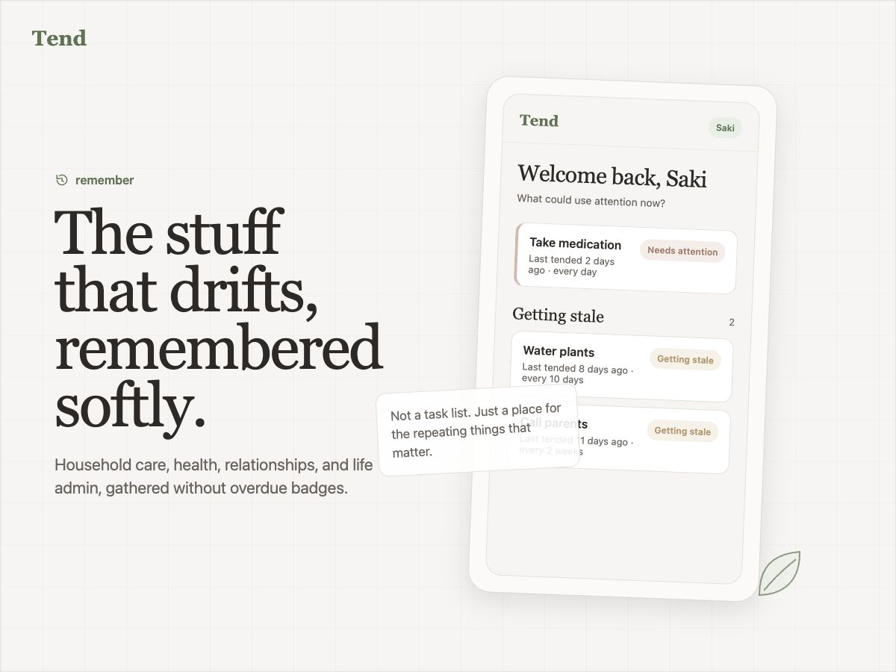

<p align="center">
  
</p>

<p align="center">
  <a href="https://github.com/saksofon997/tend/actions/workflows/ci.yml"></a>
  <a href="https://app.tend.qzz.io"></a>
</p>

<p align="center"><strong>The stuff that drifts, remembered softly.</strong></p>

Tend is a lightweight life-maintenance app for recurring things that matter — household care, health upkeep, relationships, pets, vehicles, and life admin — without guilt-driven overdue tasks or productivity theater.

> What parts of my life could use attention now?



---

## Product

### Who it's for

People who want help remembering recurring parts of real life without adopting a task manager. Open it once or twice a week in a quiet maintenance mindset: check what needs care, mark something tended, or add a recurring item before it drifts out of memory.

### How it works

| Concept | What it means |
|---------|---------------|
| **Tend item** | A recurring thing you maintain — change bed sheets, call parents, pay a bill |
| **Must / Want** | Must items get stronger attention; Want items can drift without shame |
| **Rhythm** | How often you want to tend it — every week, month, quarter… |
| **Status** | Derived from rhythm + last tended — *Fresh*, *Getting stale*, *Needs attention* |
| **Availability** | When you're usually free — reminders respect your schedule, not a calendar sync |

### Principles

- No strict due dates for wants
- No streaks or red “overdue” punishment
- Reminders create awareness, not pressure
- Add an item in under a minute

More product context: [`PRODUCT.md`](PRODUCT.md) · [`docs/mvp-user-stories.md`](docs/mvp-user-stories.md)

---

### Pre-alpha — shipped

Pre-alpha is **complete**: a web-first app with local Postgres, email/password accounts, and the full tend loop. Invite-only access is optional via `ALLOWED_EMAILS`.

| Area | What's included |
|------|-----------------|
| **Accounts** | Register, login, logout, sessions (Lucia + bcrypt) |
| **Onboarding** | Concept intro, preset picker across six life areas, skip-friendly |
| **Items** | Create, edit, archive, delete; Must/Want, rhythm, optional life area |
| **Attention home** | Hero item, grouped sections, life-area filter, quick “Mark tended” |
| **Item detail** | Status, history, edit form, correct past tend dates |
| **Reminders** | Availability windows, in-app reminder surface, mark tended from reminder |
| **Activity** | Recent tend events across items |
| **Presets** | ~22 suggested tends across household, health, relationships, pets, vehicle, admin |

Plan and exit criteria: [`docs/pre-alpha-development-plan.md`](docs/pre-alpha-development-plan.md)

---

### Alpha — next

Moving toward a small hosted alpha: public entry, safer account lifecycle, richer presets, and lower signup friction.

| Area | Planned |
|------|---------|
| **Public shell** | Landing page, sample Privacy + Terms, footer links |
| **Account deletion** | User-initiated hard delete with confirmation |
| **Expanded presets** | 10–12 life areas, ~70–90 suggested tends |
| **i18n** | English + Serbian |
| **Email** | Transactional provider, password reset, deletion confirm |
| **Google signup** | OAuth alongside email/password |

Roadmap and phases: [`docs/alpha-roadmap.md`](docs/alpha-roadmap.md) · implementation detail: [`docs/alpha-development-plan.md`](docs/alpha-development-plan.md)

**Not in alpha:** native mobile, push notifications, calendar sync, payments, cloud sync beyond hosted Postgres.

---

## Development

### Tech stack

| Layer | Technology |
|-------|------------|
| Runtime / package manager | [Bun](https://bun.sh) |
| Language | TypeScript (strict) |
| Web app | Next.js 15 (App Router) + React 19 |
| UI | Tailwind CSS + shadcn/ui |
| Database | PostgreSQL 16 |
| ORM | Drizzle |
| Auth (pre-alpha) | Lucia + bcrypt (local sessions) |
| Monorepo | Bun workspaces + Turborepo |
| Lint / format | Biome |

Mobile (Expo / React Native) is planned after web alpha; shared domain logic lives in `packages/domain`.

### Repository structure

```
apps/web/           Next.js UI and /api/v1 REST routes
packages/domain/    Status, rhythm, reminders, presets (pure TS)
packages/db/        Drizzle schema and migrations
docs/               Product specs, API reference, design system, roadmaps
```

**UI changes:** Read [`docs/design/README.md`](docs/design/README.md) first. Reuse components from `apps/web/components/`; see `.cursor/rules/ui-design.mdc`.

### Prerequisites

- [Bun](https://bun.sh) ≥ 1.2
- [Docker](https://www.docker.com/) (for local Postgres)

### Getting started

#### 1. Clone and install

```bash
git clone <repo-url> tend
cd tend
bun install
```

#### 2. Environment

```bash
cp .env.example .env
# Edit .env — set SESSION_SECRET to a random 32+ byte string
```

#### 3. Database

Start Postgres and apply migrations (migrate waits for the database to accept connections):

```bash
bun run setup:db
```

Or step by step:

```bash
docker compose up -d
bun run db:migrate
```

If migrate fails with "database system is starting up", wait a few seconds and run `bun run db:migrate` again — or use `setup:db` which retries automatically.

#### 4. Development

```bash
bun run dev
```

Open [http://localhost:3000](http://localhost:3000).

Health check: [http://localhost:3000/api/v1/health](http://localhost:3000/api/v1/health)

### Scripts

| Command | Description |
|---------|-------------|
| `bun run dev` | Start web app in development |
| `bun run build` | Production build |
| `bun run ci:check` | Full CI pipeline locally (lint → migrate → test → build) |
| `bun run test` | Run all tests |
| `bun run lint` | Lint and format check (Biome) |
| `bun run setup:db` | Start Postgres (Docker) and apply migrations |
| `bun run db:migrate` | Apply Drizzle migrations (waits for Postgres) |
| `bun run db:studio` | Open Drizzle Studio |

### Git hooks

After `bun install`, Husky runs the same checks as CI before each commit (`bun run ci:check`). Postgres must be running — start it with `bun run setup:db` or `docker compose up -d`.

To run the checks manually without committing:

```bash
bun run ci:check
```

### Manual QA

Before sharing with testers, walk through [`docs/manual-test-script.md`](docs/manual-test-script.md) — it covers all 14 MVP user stories.

### Deployment

Production hosting uses **Vercel** (app), **Neon** (Postgres), and **Cloudflare** (DNS). Step-by-step setup: [`docs/deployment.md`](docs/deployment.md).

### API documentation

HTTP endpoints are documented under [`docs/api/`](docs/api/README.md) as they are implemented. Base path: `/api/v1`.

---

## License

MIT — see [LICENSE](LICENSE).
