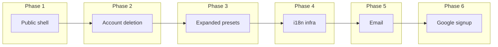

# Tend Alpha Roadmap

> **Goal:** Move from invite-only pre-alpha to a small hosted alpha where people can understand what Tend is, sign up safely, use the app in English or Serbian, and leave cleanly if they choose to.

**Starting point:** Pre-alpha is complete — Lucia email/password auth, optional invite list (`ALLOWED_EMAILS`), full tend flows (items, reminders, availability, activity). See [`pre-alpha-development-plan.md`](./pre-alpha-development-plan.md).

**Implementation detail (Phases 1–4):** Testable iterations, exit criteria, and manual smoke scripts — [`alpha-development-plan.md`](./alpha-development-plan.md).

**Architecture unchanged:** Bun monorepo, `packages/domain` for business logic, Next.js web app + REST `/api/v1`, Drizzle + Postgres.

---

## Alpha scope

### In scope

| Area | Summary |
|------|---------|
| Public shell | Landing page, Privacy + Terms sample pages, footer links |
| Account deletion | User-initiated hard delete with confirmation |
| Expanded presets | More life-area categories and more suggested tends per area |
| i18n | English primary, Serbian secondary (user-assisted translations) |
| Email | Transactional email provider + password reset |
| Google signup | OAuth sign-in / registration alongside email/password |

### Explicitly not in alpha

Cloud sync beyond hosted Postgres, native push, calendar integration, payments, full legal review by counsel (sample Privacy/ToS only), Expo mobile app, analytics beyond basic observability.

---

## Recommended phase order

Phases are ordered to minimize rework: public-facing trust surfaces first, then compliance, then localization, then auth upgrades that touch schema.

| Phase | Theme | Rough effort | Unblocks |
|-------|--------|--------------|----------|
| 1 | Public shell | ~1 week | Anyone can learn what Tend is |
| 2 | Account deletion | 3–5 days | Honest Privacy/ToS; GDPR baseline |
| 3 | Expanded presets | 3–5 days | Richer onboarding; alpha testers find relevant tends |
| 4 | i18n (en + sr) | 1–2 weeks | Serbian alpha testers |
| 5 | Email | ~1 week | Password reset, deletion confirm, welcome |
| 6 | Google signup | ~1 week | Lower signup friction |

---

## Phase 1 — Public shell (landing + legal samples)

**Why first:** `/` is currently the authenticated home view. Alpha needs a marketing-lite entry and footer links before widening access.

### Deliverables

- [ ] **Landing page** (`/` or `/welcome`) — value prop, how Tend differs (no guilt/overdue UX), simple visual, CTAs to Register / Sign in
- [ ] **`/privacy`** — sample Privacy Policy (Markdown → page)
- [ ] **`/terms`** — sample Terms of Service (Markdown → page)
- [ ] **Footer** on auth + app shell: Privacy · Terms · Language (wired in Phase 4)
- [ ] **Route split:** unauthenticated visitors → landing; signed-in users → home (`HomeView`)

### Legal page content (minimum)

- What data is stored (email, display name, tend items, events, availability)
- No selling of personal data; hosting providers (e.g. Vercel, Neon)
- Contact email for privacy requests
- Prominent disclaimer: sample document, not legal advice

### Design

Follow [`docs/design/`](design/README.md). Reuse tokens and layout patterns from `AuthLayout`. Run impeccable `adapt` + `polish` on new UI before ship.

### Out of scope for v1

Blog, pricing page, full marketing site.

---

## Phase 2 — Account deletion

**Why before i18n/email:** Privacy policy promises deletion. DB schema already cascades on `user_id`; deletion today exists only in test helpers (`deleteUserByEmail`).

### Deliverables

- [ ] **`/settings/account`** — new settings area alongside availability
- [ ] **`DELETE /api/v1/account`** (or POST with confirm body)
- [ ] **Confirmation UX:** type email or `DELETE` + password re-entry for password users
- [ ] **Hard delete** user row → cascades items, events, sessions, settings
- [ ] **Immediate session invalidation** after delete
- [ ] **API docs:** `docs/api/account.md`
- [ ] **Integration tests:** create user, add items, delete account, assert data gone

### Alpha shortcut

Ship with in-app password/email confirmation first. Add email confirmation link in Phase 5.

---

## Phase 3 — Expanded preset catalog

**Why before i18n:** Pre-alpha ships six life areas with ~22 suggested tends (~3–4 per area). Alpha testers need a broader catalog so onboarding and quick-add feel useful, not sparse. Lock the English catalog first, then translate category labels and preset names once in Phase 4.

**Current state:** Presets live in `packages/domain/src/presets.ts`; `GET /api/v1/items/presets` returns `ALL_PRESETS`. UI surfaces: onboarding preset step, `PresetSuggestions` on add-item, life-area filter chips. `life_area` is a Postgres enum — new categories require a migration.

### Target (alpha)

| Metric | Pre-alpha | Alpha target |
|--------|-----------|--------------|
| Life areas (with presets) | 6 | **10–12** |
| Presets per area | 3–4 | **6–8** |
| Total suggested tends | ~22 | **~70–90** |

Exact categories and copy are product decisions (see open questions). `personal` stays empty — custom items only.

### Deliverables

- [ ] **Catalog spec** — finalized list of life areas, preset names, type, rhythm defaults, optional one-line descriptions
- [ ] **Stable preset keys** — e.g. `household.change-bed-sheets` for i18n (display name translatable; key stable)
- [ ] **Domain + DB** — extend `LifeArea` type and `life_area` enum; expand `presets.ts`; migration applies cleanly
- [ ] **UI** — life-area chips and preset picker show new categories; scroll/wrap gracefully when chip count grows
- [ ] **Tests** — domain unit tests per area (non-empty, valid rhythm/type); API returns expanded catalog
- [ ] **Docs** — note new enum values in API/items docs if response shape changes (e.g. preset `key`, `description`)

### Candidate new life areas (pick 4–6)

| Area | Example tends | Notes |
|------|---------------|-------|
| `self_care` | Rest day, journaling, screen-free evening | Distinct from health checkups/exercise |
| `finance` | Review budget, reconcile accounts | Overlaps admin — split bills vs. money habits |
| `food_kitchen` | Deep-clean fridge, meal prep, pantry check | Complements household cleaning |
| `home_maintenance` | Test smoke detectors, service HVAC | Longer rhythms; appliance upkeep |
| `outdoor` | Water plants, mow lawn, clear gutters | Seasonal OK |
| `kids_family` | School forms, pediatric checkup | Optional if alpha cohort includes parents |

Expand **existing** six areas (household, health, relationships, pets, vehicle, admin) with additional presets before or alongside new enums.

### Out of scope

User-submitted preset marketplace, per-user custom preset lists, ML suggestions.

---

## Phase 4 — i18n (English + Serbian)

**Why here:** Landing, legal, **and preset catalog** are easier to translate once strings are extracted. Serbian as secondary locale; product owner assists with translation quality and tone.

### Recommended stack

**`next-intl`** with App Router — locale prefix (`/en/...`, `/sr/...`) preferred for shareable links.

### Deliverables

**Infrastructure**

- [ ] Locale routing + middleware
- [ ] Message files: `messages/en.json`, `messages/sr.json`
- [ ] User preference: browser default → optional override in settings (store `locale` on `user_settings`)
- [ ] Locale-aware formatting: replace hardcoded `en-US` in `relative-time.ts` with `Intl` + active locale

**Translation scope (prioritized)**

| Priority | Surface |
|----------|---------|
| P0 | Auth, onboarding, home, status labels, reminders |
| P1 | Item forms, settings, errors/validation |
| P2 | Landing, Privacy, Terms |
| P3 | Life-area labels, preset names/descriptions (via stable preset keys from Phase 3) |

**Domain rule:** Status *logic* stays in `packages/domain`; only UI labels are translated.

**Serbian tone:** Avoid punitive equivalents for status copy (`Fresh`, `Getting stale`, `Needs attention`). Match Tend's gentle voice from [`design-language.md`](design/design-language.md).

**Tests:** Smoke test both locales on core flows; fail CI on missing translation keys.

---

## Phase 5 — Email integration

**Why after deletion + i18n:** Transactional email touches legal copy and may need localized templates.

### Provider

Resend or Postmark (simple API, good Next.js DX).

### Deliverables

| Email | Trigger | Alpha priority |
|-------|---------|----------------|
| Password reset | Forgot password flow (new) | **High** — omitted in pre-alpha |
| Account deleted | After deletion | Medium — completes Phase 2 |
| Welcome | Register | Nice to have |
| Verify email | New signup | Optional for invite-only alpha |

**Also add**

- [ ] **`/forgot-password`**, **`/reset-password`** routes + API
- [ ] Env vars: `EMAIL_FROM`, provider API key
- [ ] Update `.env.example` and README

**Invite list:** `ALLOWED_EMAILS` can still gate registration independently of email.

---

## Phase 6 — Sign up with Google

**Why last:** Requires schema and auth changes; email/password path should stay stable first.

### Current constraint

`password_hash` is `NOT NULL` on `users`. OAuth users need nullable password + linked identity table.

### Deliverables

- [ ] **`oauth_accounts`** table (provider, provider_user_id, user_id)
- [ ] **Google OAuth** via Lucia + Arctic (or evaluate Auth.js if Lucia OAuth is too heavy)
- [ ] **Auth UI:** "Continue with Google" on login/register
- [ ] **Account linking:** Google email matches existing password account → link or prompt password sign-in first
- [ ] **Respect `isEmailAllowed()`** on new registrations when invite list is active
- [ ] **Settings:** show sign-in method; optional "set password" for Google-only users
- [ ] **Integration tests** for OAuth account creation + session

---

## UI routes (alpha additions)

| Route | Purpose |
|-------|---------|
| `/` or `/welcome` | Public landing (exact split TBD in Phase 1) |
| `/privacy` | Sample Privacy Policy |
| `/terms` | Sample Terms of Service |
| `/forgot-password` | Request reset link (Phase 5) |
| `/reset-password` | Set new password from token (Phase 5) |
| `/settings/account` | Account deletion + sign-in methods (Phases 2, 6) |
| `/en/*`, `/sr/*` | Locale-prefixed app routes (Phase 4) |

Existing pre-alpha routes unchanged: `/login`, `/register`, `/onboarding`, `/items/*`, `/settings/availability`, `/activity`.

---

## Cross-cutting alpha checklist

Before calling alpha "open":

- [ ] Landing explains product in one scroll
- [ ] Privacy + Terms linked on all auth surfaces
- [ ] User can delete account and all associated data
- [ ] Preset catalog expanded (10+ areas, 6+ tends per area)
- [ ] English + Serbian usable on core flows
- [ ] Password reset works via email
- [ ] Google signup available (optional but shipped)
- [ ] `ALLOWED_EMAILS` strategy decided (see open questions)
- [ ] Lint passes on changed files
- [ ] Domain + API tests pass for new endpoints
- [ ] `docs/api/` updated for new HTTP surface

---

## Suggested timeline

| Weeks | Focus |
|-------|--------|
| 1 | Landing + Privacy + Terms + route split |
| 2 | Account deletion + settings area |
| 3 | Preset catalog spec + domain/DB + UI |
| 4–5 | i18n infra + English extraction + Serbian translation pass |
| 6 | Email provider + password reset |
| 7 | Google OAuth + polish |

**Parallel work:** Draft Serbian strings while Phase 1 ships in English-only; draft expanded preset list while Phase 2 ships; wire translations in Phase 4 after catalog is locked.

---

## Open questions (resolve before Phase 1 ship)

| Question | Options | Notes |
|----------|---------|-------|
| Open alpha vs invite-only | Keep `ALLOWED_EMAILS` vs drop for public signup | Closed cohort may suit Serbian/English tester group |
| Locale URL strategy | `/sr/login` prefix vs cookie-only | Prefix recommended for shareable links |
| Email verification | Required at signup vs defer | Defer OK if invite list remains |
| Legal | Sample pages only vs lawyer review | Sample sufficient for small alpha with disclaimer |
| New life areas | Which 4–6 categories to add | See Phase 3 candidates; finalize before migration |
| Preset catalog size | ~70 vs ~90 tends | Balance picker UX vs coverage; group long lists per area |

---

## After alpha

Per [`pre-alpha-development-plan.md`](./pre-alpha-development-plan.md) post-pre-alpha direction:

1. Dogfood alpha feedback; tune status thresholds and copy (both locales).
2. Expo mobile app consuming `/api/v1`.
3. Push notifications using same reminder engine in `packages/domain`.
4. Calendar integration, payments, and broader i18n (RTL, more locales) as separate epics.

---

## Definition of done (alpha)

- [ ] All six phases delivered at MVP level for each area
- [ ] Sample Privacy + Terms published and linked
- [ ] Account deletion tested end-to-end
- [ ] Expanded preset catalog live in domain, API, onboarding, and add-item flows
- [ ] `en` + `sr` message files complete for P0/P1 surfaces; preset names/descriptions in P3
- [ ] Password reset email flow working in production
- [ ] Google OAuth sign-in working alongside email/password
- [ ] README and `.env.example` document new env vars and setup
